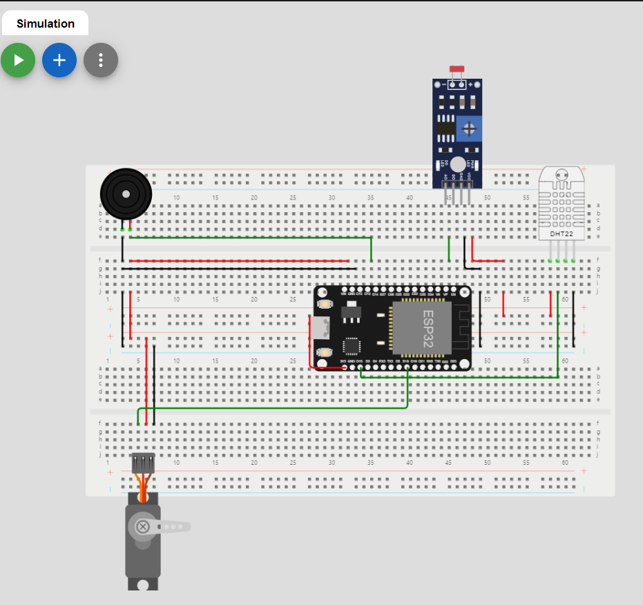
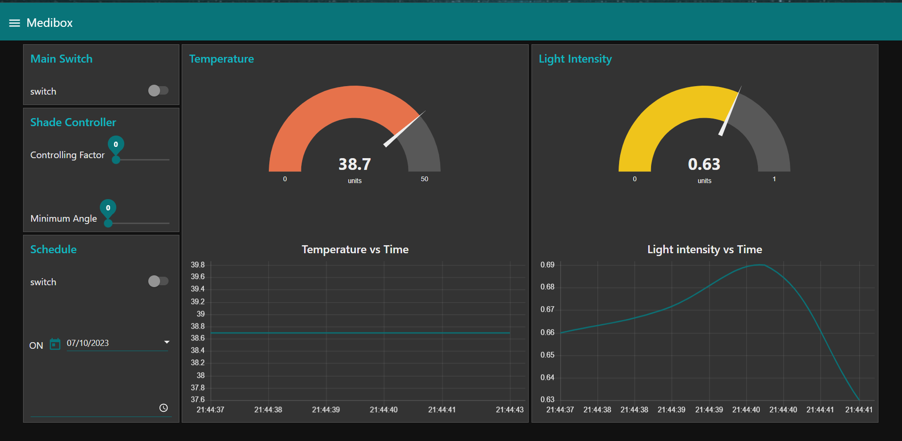

# Medi-Box
Medibox is an IOT-related smart device that assists users in managing their medication schedules effectively  and ensure the safe storage of medications in a light-controlled environment.

## Table of Contents

- [Introduction](#Introduction)
- [Features](#features)
- [Technologies Used](#technologies-used)
- [Usage](#usage)

## Introduction
The **Medi Box** project aims to enhance the medication management experience of a patient by offering numbet of crucial functionalities including,

- Scheduled alarms and reminders for taking medications.
- Sefe storage of medications in a light-controlled environment.
- Real-time environmental monitoring (Temperature, Light-intensity, Humidity).
- Remote control over Wi-Fi for simple amanagement.

## Features

- **Medication Reminders**: The User can set up medication schedules through Node-RED platform and receive timely reminders(Alrms)
- **Secure Medication Storage**: A shaded sliding window has been installed to prevent excessive light from entering the Medibox. The user is able to adjust the minimum angle and controlling factor according to the type of the drug through the Node-RED dashboard.
- **Environmental Monitoring**: Real-time environmental monitoring (Temperature, Light-intensity, Humidity)
- **User-Friendly Interface**: Users can easily control the Medi-Box using the Node-Red dash board.

## Technologies Used

- **Arduino**: Programming the ESP32 microcontroller.
- **Altium Designer**: Schematic and PCB design.
- **Node-Red**: Flow-based development platform for designing the user interface.
- **MQTT**: Message Queuing Telemetry Transport, a lightweight communication protocol widely used for IoT applications.
- **Wokwi**:IoT and Embedded System Simulator

